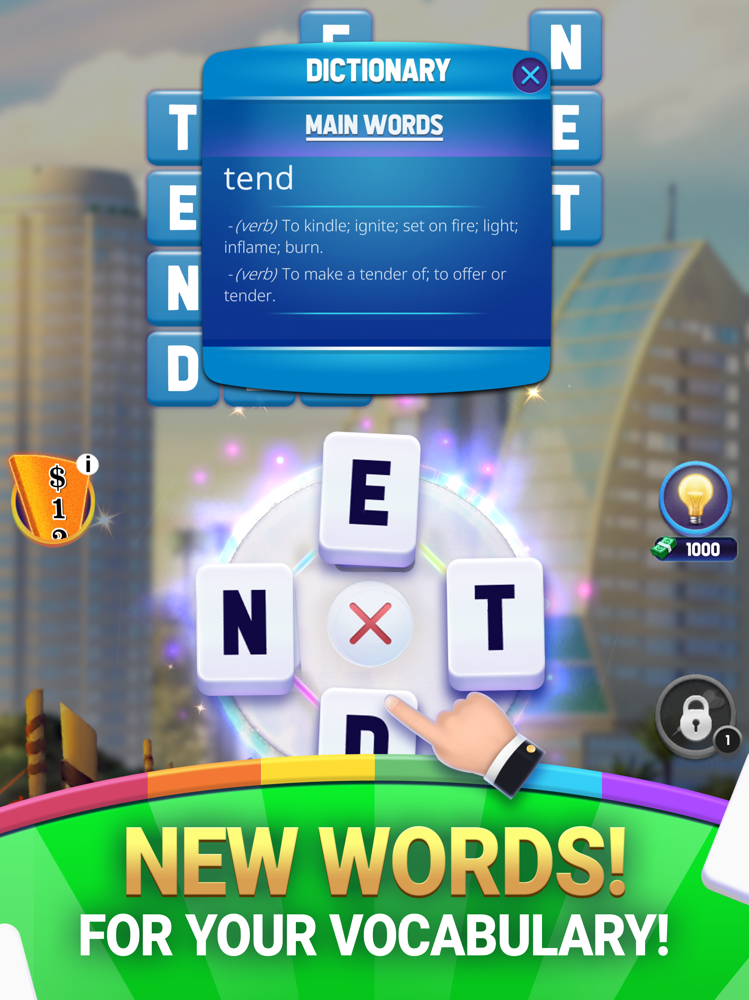
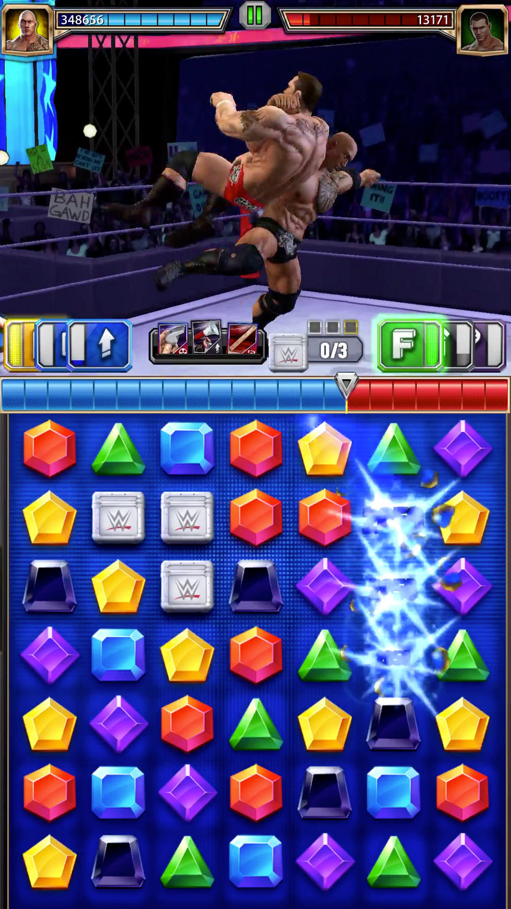
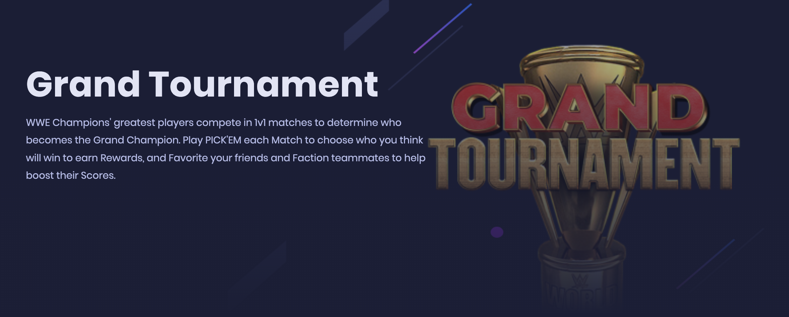
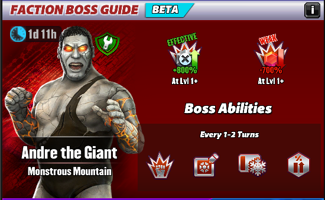

<h1 align="center"><strong>Dao My Hai</strong></h1>

Welcome to my professional portfolio. I'm a Senior Unity Developer with over 6 years of experience in the IT industry, specializing in gaming. Here, you'll find a selection of projects that best showcase my skills and contributions to the game development field.

## About Me

Professional and experienced Senior Unity Developer specializing in creating engaging gameplay experiences for mobile, PC, and WebGL platforms. Passionate about driving innovation in the gaming industry through collaborative development and cutting-edge technologies.

## Contact Information

- Email: hai.daotk@gmail.com

---

## Projects
### Word Of Fortune: Mobile words game
- **Project Links:** [Play Store](https://play.google.com/store/apps/details?id=com.sonypicturestelevision.wordsoffortune&hl=en_US)
- **Project preview images:** 

    
    
    

- **Role:** Unity Developer
- **Description:** Starting off inspired by WordScapes, our game evolved into its own unique word puzzle adventure, blending the Wheel Of Fortune theme (thanks to Sony's copyright) with a twist. It's packed with diverse modes, quests, and levels, all designed with a smart difficulty curve—thanks to an AI model that keeps it challenging yet fun. A perfect mix of brain teasers and entertainment!

- **Background**: 
    Jumping into game development, my **first significant project** was a thrilling ride from the get-go. From **crafting prototypes** to **developing custom tools for data handling** and **game design**, I got to touch every corner of the project. The highlight? Implementing diverse gameplay modes that kept players coming back for more—**daily challenges, progression achievements**, and **customizable leaderboards** to name a few.

    I learned to break down complex tasks with Game Designers, and work seamlessly with a creative team of Artists, VFX specialists, QAs, and clients. The outcome? A game that we're all proud of, blending **technical prowess with creative vision**.
- **Technologies Used:** Unity, Python, C#, optimizations, UIs, animations, 3rd parties SDK
- **Target Platform:** Android, iOS
- **Results:** Successfully launched the title globally after 2 years of development.

- **Challenges and Solutions:** 
   - The main challenge was designing **intuitive puzzle mechanics** that appealed to a broad audience. Solved this by **creating 2 different tools** for game designers, one **GUI friendly** so that the level can be hand-crafted by game designers, another was **automated so that mass levels can be generated beforehand** and scored using an outsourced AI model.
    - Instead of a pure 2D game, we went with the direction of **2.5D game feel**, I was in charge of making the background more alive by working with 2D artists to break down the background environment into multiple parts and use a **parallax-effect** to make it move when the phone is tilted. This system was reusable and scaled to applied to more than **200 different backgrounds** without changing too much for code base.
    - The game is very heavy with a lot of 2D assets, so the obvious design was to make the assets into bundles stored on a separate CDN and loaded on demand by using **Unity Asset Bundle** design (this was before the Addressable system). I was not in charge of building the asset bundle system, but I learned the process of making/automating building the assets into bundles and load-on-demand the assets as well as techniques on how to avoid mistakenly loading unnecessary assets into the scene by reference.
    - A few more **optimization techniques** were used by me to make the game run smoothly on targeted devices such as a reusable pool of objects/VFXs, disable/hide objects/UI that did not need to show at run-time, optimizing assets, code performance when reviewing code under senior and tech lead mentor, etc.

### WWE Champions: WWE Theme Puzzle Mobile Game 

- **Project Links:** 
    - [Play Store](https://play.google.com/store/apps/details?id=com.scopely.whiplash&hl=en) 
    - [Website](https://wwechampions.com/)
- **Project preview images:** 

    
    
    

- **Role:** Unity Developer
- **Technologies Used:** Unity, Xsolla, optimizations
- **Target Platform:** Android, iOS, WebGL
- **Project Description:** A match 3 puzzle game with the element of world famous series WWE. Brain tease and action packed at the same time.
- **Background**: I joined this project during the process of moving the game into the WebGL platform so that our client can re-direct in-app payment to web based solution Xsolla, which has a lower fee than Google Play and Apple Store. After that I stayed and help re-structure the code-base to support real-time multiplayer game play using WebSocket for both mobile & webGL. I also delivered a few custom feature for WebGL only using A/B config as well as other feature that run on both platforms.
- **Results:** 
    - Successfully launched the WebGL version that met target of under 10s loading time, build sizes and concurrent gameplay time. 
    - Integrated Xsolla as the default payment for WebGL platform, which increase the profit overall.
    - Complete mutliple feature sprints, clear backlog bugs, optimize assets, tracking and monitor realtime alerts ultiziling services such as DataDog, SumoLog.
    - Working on this project offered me the chance to collaborate with diverse teams—from in-house development to live ops, back-end (BE), devops, international marketing, outsourcing partners, and more. This experience broadened my understanding of game operation inside and out.
- **Challenges and Solutions:**
    - The main challenge in this project was navigating a **huge code base** from a game nearly 7 years old. It was filled with decoupled logic and outdated features, presenting a **steep learning curve** for newcomers.
    - Another issue was the **build size and initial load time**. Optimized for mobile app stores, the game's size became problematic on the WebGL platform, leading to slow unpacking and loading. The fix involved downsizing asset resolutions, enhancing compression, omitting sound assets to let the front end handle background music, and streamlining loading steps—a balance between quality and user experience (UX).
    - The game **boasted a vast collection of high-quality 3D models**, where **garbage collection (GC) performed adequately on mobile but faltered on WebGL**, causing frequent crashes when exceeding 2GB of memory. The remedy was to rewrite shaders for many 3D models, excluding certain render properties like metallic and emission, thus halving memory usage per shader. This seemingly minor adjustment, applied across hundreds of models, significantly improved gameplay time by 30%, again highlighting the quality-UX trade-off.

### PlanetSandbox: Blockchain TPS Sandbox Shooter
- **Gameplay:** [Youtube ](https://youtu.be/xLujMxzOvVg?si=2bYm4Idd6vAEXy-y)
- **Project preview images:** N/A
- **Role:** Senior Game Developer
- **Technologies Used:** Unity, Photon Fusion, Blockchain (Wallet SDK, NEthereum SDK)
- **Project Description:** Spearheaded the development of a TPS sandbox shooting game incorporating blockchain technology for secure in-game transactions and digital asset management.
- **Results:** Developed a fully functional game with blockchain-integrated features, leading to a novel gaming experience that combined traditional gameplay with modern digital asset transactions.
- **Background**: 
    - My first foray into PC titles marked a shift from puzzle games to a Multiplayer TPS shooter, incorporating Royal Battle elements.
    - I took the lead in designing and creating a PVE Zombie-mode, where players collaborate to fend off zombie hordes.
    - Part of my responsibilities included optimizing and maintaining the current PVP mode through the Fusion network solution, along with developing additional features. These included loot boxes that drop skills, a versatile gun system with stats configurable via backend/admin pages, a leaderboard for scoring (utilizing .NET for backend and Redis, MongoDB for databases), UI reskins, and training new team members.
- **Challenges and Solutions:** 
    - **Integrating blockchain technology** presented a steep learning curve. Overcame this by collaborating with blockchain experts and extensively researching to implement Wallet SDK and NEthereum SDK effectively.
    - **Learned the fundemental of fast pace realtime multiplayer network solution and design like Fusion**. Optimizing data packages into small chunk size to reduce chances of package loss and faster sync time.

### Project Title(NDA): WebGL Mini-Games Compilation

- **Role:** Senior Unity Developer
- **Technologies Used:** Unity, WebGL, GitLab CI/CD, Solidity, Go, TypeScript
- **Project Links:** N/A
- **Project preview images:** N/A
- **Project Description:** Developed a series of engaging mini-games for the WebGL platform and Web3 elements, focusing on accessibility and high engagement rates. Managed the project from conception to deployment, ensuring optimal performance and user experience.
- **Results:** Successfully launched multiple mini-games, achieving over 200k+ gameplay engagements within a month, maintain and upgrade for smooth user experience after that.
- **Challenges and Solutions:**
    - Faced challenges in optimizing game performance for web platforms. Implemented efficient coding practices and leveraged Unity's WebGL optimization tools to enhance game load times and performance.
    - Immersed myself in blockchain technology, taking on various roles including backend (BE) and contracts to ensure timely product delivery.
    - Led a compact team of Unity devs, frontend (FE), BE, contract workers, and UI/UX designers. Tasked with breaking down tasks and overseeing team progress.
    - Established a robust CI/CD pipeline using GitLab, featuring automated builds with custom runners, Slack alerts for build outcomes, and automated uploads to Google Cloud Storage (GCS). This setup greatly accelerated development cycles and testing phases.
---

## Skills

- Game Programming and Design
- Proficient in Unity and WebGL development
- Strong background in object-oriented programming (OOP), DSA, game releated design patterns.
- Expertise in game development process, from prototyping to release globally on multiple platforms.

---

This portfolio is a testament to my dedication and passion for game development. Each project represents a step forward in my journey as a developer, showcasing my ability to tackle challenges, innovate, and work collaboratively to create memorable gaming experiences.
